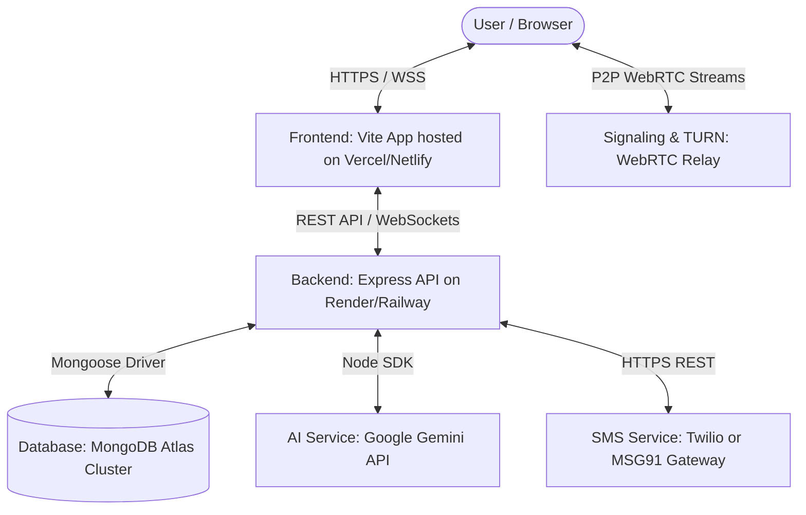

# 🌐 MindLink Production Deployment Guide

This guide provides a comprehensive, step-by-step roadmap to successfully deploy the MindLink Mental Health platform to production. 

By following these instructions, all key features—including **Google Sign-In**, **OTP Authentication**, **Real-Time Websocket Notifications**, **Google Gemini AI (CBT Buddy)**, and **WebRTC Video/Audio Rooms**—will function seamlessly in a secure, production-hardened environment.

---

## 🏗️ System Architecture Topology

MindLink operates as a modern decoupled web application:


---

## 🗄️ Step 1: Provision the MongoDB Atlas Database

1. **Sign Up:** Go to [MongoDB Atlas](https://www.mongodb.com/cloud/atlas) and register for a free account.
2. **Create Cluster:** Create a new Shared Cluster (M0 Free tier) in your preferred cloud provider and region.
3. **Database Security (User):**
   * Go to **Database Access** under the Security tab.
   * Click **Add New Database User**.
   * Choose **Read and Write to any database** privileges, enter a secure username and password, and save them.
4. **Network Access (IP Whitelist):**
   * Go to **Network Access**.
   * Click **Add IP Address**.
   * Click **Allow Access from Anywhere** (`0.0.0.0/0`) or input your backend server's static IP to authorize incoming connection requests, then save.
5. **Get Connection String:**
   * Go to the Database Deployment panel and click **Connect**.
   * Choose **Connect your application (Drivers)**.
   * Copy the connection string:
     `mongodb+srv://<username>:<password>@cluster.mongodb.net/mindlink?retryWrites=true&w=majority`
   * Replace `<username>` and `<password>` with the credentials of your database user.

---

## 🔑 Step 2: Configure Google OAuth 2.0 Sign-In

To enable seamless **Google Sign-In** on the landing and registration pages:

1. **Google Cloud Console:** Navigate to the [Google Cloud Console](https://console.cloud.google.com/).
2. **Create Project:** Create a new project or select an existing one.
3. **OAuth Consent Screen:**
   * Go to **APIs & Services > OAuth Consent Screen**.
   * Select **External** User Type (unless deploying for an internal corporate domain) and click **Create**.
   * Fill out the app name, support email, and developer contact details.
   * Add the scope: `auth/userinfo.email` and `auth/userinfo.profile`.
   * Under **Publishing Status**, click **Publish App** to push it live.
4. **Create OAuth Client ID:**
   * Go to **APIs & Services > Credentials**.
   * Click **Create Credentials > OAuth Client ID**.
   * Select **Web Application** as the application type.
   * **Authorized JavaScript Origins:** Add your local dev URL and your production frontend URL:
     * `http://localhost:5173`
     * `https://your-frontend-app.vercel.app`
   * **Authorized Redirect URIs:** Add the redirect endpoints:
     * `http://localhost:5173`
     * `https://your-frontend-app.vercel.app`
5. **Collect Key:** Copy the generated **Client ID** (looks like `xxxx.apps.googleusercontent.com`).

---

## 💬 Step 3: Configure Twilio or MSG91 OTP Authentication

MindLink supports flexible OTP configurations via a modular backend driver setup. You can choose from **Twilio**, **MSG91 (Direct)**, **MSG91 (Widget)**, or a simulated **Development Mode**.

### Option A: Twilio Gateway (Recommended for global messaging)
1. Sign up for a [Twilio Account](https://www.twilio.com/).
2. Navigate to your Twilio Dashboard and purchase an active SMS-enabled Phone Number.
3. Copy your Twilio credentials:
   * **Account SID**
   * **Auth Token**
   * **Phone Number** (in international standard E.164 format, e.g., `+1234567890`)
4. **Backend variables to set:**
   * `OTP_DRIVER=twilio`
   * `TWILIO_ACCOUNT_SID=your_account_sid_here`
   * `TWILIO_AUTH_TOKEN=your_auth_token_here`
   * `TWILIO_PHONE_NUMBER=your_twilio_phone_number`

### Option B: MSG91 Direct API
1. Register on [MSG91](https://msg91.com/).
2. Create an OTP template inside your MSG91 dashboard and obtain a **Template ID**.
3. Generate a secure API **Auth Key**.
4. **Backend variables to set:**
   * `OTP_DRIVER=msg91`
   * `MSG91_AUTH_KEY=your_auth_key_here`
   * `MSG91_TEMPLATE_ID=your_template_id_here`

### Option C: MSG91 Widget Integration (Client-Side Verification)
If you prefer MSG91's out-of-the-box Web Widget:
1. Generate your Widget ID and Widget auth keys on MSG91.
2. **Frontend variables to set:**
   * `VITE_MSG91_WIDGET_ID=your_widget_id`
   * `VITE_MSG91_TOKEN_AUTH=your_auth_token`
3. **Backend variables to set:**
   * `OTP_DRIVER=msg91_widget`
   * `MSG91_AUTH_KEY=your_auth_key`

---

## 🧠 Step 4: Obtain your Google Gemini AI Key

The **CBT AI Buddy Companion**, **Therapist SOAP Note Draft Generator**, and **AI Facial Mood Analyzer** run on the next-gen `@google/genai` client using the optimized `gemini-2.5-flash` model.

1. Navigate to the [Google AI Studio Console](https://aistudio.google.com/).
2. Click **Get API Key** in the top left corner.
3. Choose **Create API Key** (either inside an existing Google Cloud project or a new one).
4. Copy the generated API key.
5. **Backend variables to set:**
   * `GEMINI_API_KEY=AIzaSy...`

---

## 📹 Step 5: Configure WebRTC STUN & TURN Servers

Audio/video counseling rooms use P2P peer connections. 
* **STUN (Session Traversal Utilities for NAT):** MindLink is pre-configured with Google and Twilio public STUN servers to resolve connection paths instantly.
* **TURN (Traversal Using Relays around NAT):** If participants are behind restrictive firewalls (such as corporate or public networks), a TURN relay server is required.
* **Out-of-the-Box Fallback:** If you do not provide custom TURN variables, MindLink automatically falls back to clean, secure public TURN/STUN relays from `metered.live` to guarantee peer connections connect instantly across all networks!
* **Enterprise Setup:** For high-volume production, configure a dedicated TURN provider (like Metered.live or Xirsys) and set these environment variables during your **Frontend Build**:
  * `VITE_TURN_URL=your_turn_server_url`
  * `VITE_TURN_USERNAME=your_turn_username`
  * `VITE_TURN_CREDENTIAL=your_turn_password`

---

## 🚀 Step 6: Deploy the Backend Service (e.g., Render / Railway)

The backend comes pre-configured with a custom `render.yaml` and `railway.json`, making it plug-and-play for Render or Railway.

### Deployment Instructions (Render Web Service)
1. Log in to [Render](https://render.com/).
2. Click **New +** and select **Web Service**.
3. Link your GitHub repository.
4. **Settings:**
   * **Name:** `mindlink-backend`
   * **Runtime:** `Node`
   * **Root Directory:** `backend` *(Ensure you set this so Render builds inside the backend workspace folder)*
   * **Build Command:** `npm install`
   * **Start Command:** `npm start`
5. **Environment Variables Config:** Add these variables in the **Environment** tab:

| Variable Name | Recommended Value / Details | Purpose |
| :--- | :--- | :--- |
| `NODE_ENV` | `production` | Enforces stricter rate limits and optimized logging levels |
| `PORT` | `5001` | Express server port bind |
| `MONGODB_URI` | *[Your MongoDB Atlas Connection String]* | Secure access to the database |
| `JWT_SECRET` | *[Generate a 32+ character random string]* | Key for encrypting and signing auth tokens |
| `JWT_EXPIRES_IN` | `8h` | Token expiration lifespan |
| `FRONTEND_URL` | `https://your-frontend-app.vercel.app` | Whitelists frontend domain for CORS and Sockets |
| `GEMINI_API_KEY` | `AIzaSy...` | Powers CBT AI Buddy and SOAP note drafting |
| `OTP_DRIVER` | `twilio` (or `msg91` / `development`) | Specifies SMS gateway route |
| `TWILIO_ACCOUNT_SID` | *[Your Twilio SID]* (if using Twilio) | Credentials |
| `TWILIO_AUTH_TOKEN` | *[Your Twilio Token]* (if using Twilio) | Credentials |
| `TWILIO_PHONE_NUMBER` | *[Your Twilio Phone Number]* (if using Twilio) | Credentials |

---

## 🎨 Step 7: Deploy the Frontend Static Site (e.g., Vercel / Netlify)

Vite compiles code to static HTML/JS/CSS assets.

### Deployment Instructions (Vercel)
1. Log in to [Vercel](https://vercel.com/).
2. Click **Add New > Project** and select your GitHub repository.
3. **Framework Preset:** Select **Vite** (Vercel should auto-detect this).
4. **Root Directory:** Edit and set this to `frontend/` *(Crucial, as the root project is monorepo)*.
5. **Build & Development Settings:**
   * **Build Command:** `npm run build`
   * **Output Directory:** `dist`
6. **Environment Variables Config:** Add these variables to compile them directly into Vite's production assets:

| Variable Name | Recommended Value | Purpose |
| :--- | :--- | :--- |
| `VITE_API_URL` | `https://mindlink-backend.onrender.com` | Deployed backend root URL |
| `VITE_SOCKET_URL` | `https://mindlink-backend.onrender.com` | Deployed backend root URL for Websockets |
| `GEMINI_API_KEY` | *[Your Google AI Gemini key]* | Restores client-side fallback triggers |
| `VITE_MSG91_WIDGET_ID` | *[Your MSG91 Widget ID]* | MSG91 OTP widget registration (if used) |
| `VITE_MSG91_TOKEN_AUTH` | *[Your MSG91 Token]* | MSG91 OTP token (if used) |

7. Click **Deploy**. Vercel will build and assign you a secure production domain.

---

## 🧪 Step 8: Verify Your Deployment

Once both services are active, run these verification tests:

1. **Verify Backend Health:**
   Visit `https://your-backend-app.onrender.com/health` in your browser.
   * **Expected Response:**
     ```json
     {
       "success": true,
       "message": "MindLink API is running!",
       "environment": "production",
       "database": { "state": 1, "stateText": "connected" }
     }
     ```
2. **Verify Google Sign-In & Onboarding:**
   Navigate to the deployed landing page. Click **Login with Google**. The Google auth overlay should display, allow authentication, and cleanly redirect you to register or log in.
3. **Verify OTP Dispatches:**
   Sign up using a standard mobile phone number. If `OTP_DRIVER` is set to `twilio` or `msg91`, verify that the E.164 formatted number receives an SMS verification text. 
4. **Verify WebSocket Notifications:**
   Open two different browser windows. Log in as a Client in one window and a Therapist in the other. Send a message from the Client. Verify that the Therapist's sidebar instantly displays a pulsing red notification dot, and that a floating glassmorphic toast notification slides onto their screen in real-time.
5. **Verify Peer Video Room:**
   Enter a peer support room from both devices. Grant camera/audio access and verify that the WebRTC peer handshake connects immediately and renders high-quality stream windows.
