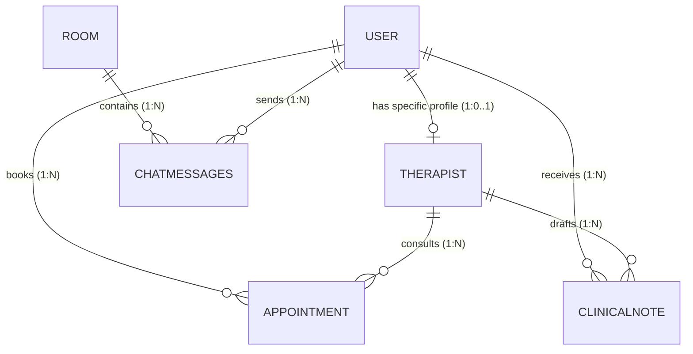
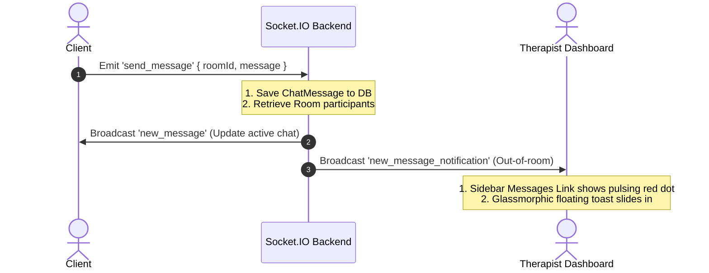

# 🌟 MindLink Architecture & Codebase Documentation

This document provides a comprehensive, deep-dive architectural and functional overview of the **MindLink Mental Health & Counseling Platform**. It maps out the directory tree, database schema schemas, REST endpoints, real-time Socket.IO sequence, WebRTC video calling pipeline, and Google Gemini AI modules.

---

## 📂 Project Directory Structure

MindLink is organized as a decoupled monorepo leveraging npm Workspaces:

```text
mindlink/
├── package.json              # Monorepo root configuration and workspace runner scripts
├── DEPLOYMENT_GUIDE.md       # Step-by-step production hosting guidelines
├── PROJECT_EXPLANATION.md    # This comprehensive architecture and codebase guide
├── backend/                  # Node.js + Express + Socket.IO Server
│   ├── package.json          # Backend dependencies (express, mongoose, socket.io, @google/genai)
│   ├── server.js             # Main server entry, CORS configuration, and boot cleanups
│   ├── src/
│   │   ├── config/           # MongoDB connection establishment
│   │   ├── middleware/       # Authentication, validation, and error handlers
│   │   ├── models/           # MongoDB schemas (User, Therapist, Room, ChatMessage, SOAP Notes, OTP)
│   │   ├── routes/           # Express REST endpoints (auth, rooms, appointments, AI, OTP, therapists)
│   │   └── socket/           # Real-time WebSocket notification and messaging handler
├── frontend/                 # Vite + React + TypeScript + WebRTC Client
│   ├── package.json          # Frontend packages (react, react-router-dom, simple-peer, socket.io-client)
│   ├── vite.config.ts        # Vite environment defines, manual Rollup asset splitting
│   ├── src/
│   │   ├── App.tsx           # React Router route registry (public, member, and therapist portals)
│   │   ├── index.tsx         # Virtual DOM mount point
│   │   ├── context/          # AuthContext for global JWT token state
│   │   ├── services/         # Axios API connection initialization
│   │   ├── mood/             # Client-side facial expression camera tracking interface
│   │   └── components/
│   │       ├── ui/           # Dashboard sidebar layouts, toast notifications, icons
│   │       └── pages/        # Client views (CBT Buddy, Peer Rooms, Messages, Therapist Directory)
└── shared/                   # Shared types and utility modules
    ├── types/                # TypeScript shared models
    └── utils/                # Standard data formatters
```

---

## 🗄️ Database Architecture & MongoDB Schemas

MindLink utilizes **Mongoose** (MongoDB) to manage patient data, professional records, and counseling bookings. Below are the 7 core schemas:



### 1. User Schema (`backend/src/models/User.js`)
* **Purpose:** Stores credentials, roles, and profile settings for both clients and practitioners.
* **Key Fields:**
  * `email` (String, unique, indexed): Primary contact address.
  * `password` (String): Securely hashed using bcrypt.
  * `role` (String): Enforces permissions (`user` or `therapist`).
  * `isAnonymousEnabled` & `anonymousAlias` (Boolean & String): Client-privacy setting allowing clients to enter peer rooms and AI chats under a random cover alias.

### 2. Therapist Schema (`backend/src/models/Therapist.js`)
* **Purpose:** Portfolio page profile for therapists.
* **Key Fields:**
  * `user` (ObjectId): References the primary User account.
  * `specialties` (Array): Tags like CBT, depression, anxiety, trauma.
  * `experienceYears` (Number) & `education` (String).
  * `hourlyRate` (Number): Booking charge.
  * `isVerified` (Boolean): Verification status for directory visibility.

### 3. Room Schema (`backend/src/models/Room.js`)
* **Purpose:** Conversation or voice/video channels between participants.
* **Key Fields:**
  * `name` & `topic` (String): Presentation details for peer support.
  * `type` (String): `counseling` (1-on-1 private) or `peer` (group chat/video).
  * `participants` (Array): List of user IDs with `isActive` connection trackers.
  * `isActive` (Boolean): Automatic indicator of room state.

### 4. ChatMessage Schema (`backend/src/models/ChatMessage.js`)
* **Purpose:** Logs all individual chat messages.
* **Key Fields:**
  * `room` (ObjectId): References the active Room conversation.
  * `sender` (ObjectId): References the User who sent the message.
  * `message` (String): Encoded message text (maximum 1000 characters).
  * `messageType` (String): `text`, `system`, or `announcement`.

### 5. Appointment Schema (`backend/src/models/Appointment.js`)
* **Purpose:** Handles practitioner calendar bookings.
* **Key Fields:**
  * `user` & `therapist` (ObjectIds): Booking participants.
  * `scheduledDate` (Date): Time of session.
  * `duration` (Number): Minutes (defaults to 60).
  * `status` (String): `scheduled`, `confirmed`, `in-progress`, `completed`, `cancelled`, `no-show`.

### 6. ClinicalNote Schema (`backend/src/models/ClinicalNote.js`)
* **Purpose:** Confidential SOAP notes drafted by therapists.
* **Key Fields:**
  * `appointment` & `client` & `therapist` (ObjectIds): Session details.
  * `soapNote` (Object): Contains the standard four clinical sections: `subjective`, `objective`, `assessment`, and `plan`.
  * `isLocked` (Boolean): Prevents modification after clinical sign-off.

### 7. OTP Schema (`backend/src/models/OTP.js`)
* **Purpose:** Stores 6-digit SMS verification tokens.
* **Key Fields:**
  * `mobile` (String): Indexed target number.
  * `code` (String): Hashed/clear text verification token.
  * `expiresAt` (Date): Automatically configured to expire after 5 minutes.

---

## ⚡ Real-Time Socket.IO Signaling & Notifications

Websockets drive real-time messaging, notification banners, unread counts, and WebRTC handshakes:



### Key Real-time Events:
* **`send_message` / `new_message`:** Standard instant delivery in active room.
* **`new_message_notification`:** Multi-connection dispatch (all active tabs) triggering:
  * Pulsing red notification dot in [MemberDashboardLayout.tsx](file:///Users/ameypatil/Desktop/mlp/frontend/src/components/ui/MemberDashboardLayout.tsx) and [TherapistDashboardLayout.tsx](file:///Users/ameypatil/Desktop/mlp/frontend/src/components/ui/TherapistDashboardLayout.tsx).
  * Sliding, premium glassmorphic toast notification inside [TherapistDashboardPage.tsx](file:///Users/ameypatil/Desktop/mlp/frontend/src/components/pages/TherapistDashboardPage.tsx).
* **`video_call_offer` / `video_call_answer` / `ice_candidate`:** Facilitates out-of-band P2P WebRTC handshaking inside [PeerSupportRoomPage.tsx](file:///Users/ameypatil/Desktop/mlp/frontend/src/components/pages/PeerSupportRoomPage.tsx).

---

## 🧠 Google Gemini AI Integrations

MindLink leverages Google Gemini's advanced `gemini-2.5-flash` model inside `backend/src/routes/ai.js` to power:

1. **AI Facial Mood Analyzer (`/analyze-mood`):**
   * Takes a base64 camera frame from the webcam inside [MoodApp.tsx](file:///Users/ameypatil/Desktop/mlp/frontend/src/mood/MoodApp.tsx).
   * Passes the image to Gemini with structured output formatting instructions.
   * Returns detected emotions (`Happy`, `Sad`, `Angry`, `Neutral`, `Anxious`) alongside confidence ratings.
2. **Actionable Recommendations (`/suggestions`):**
   * Generates 3-5 positive, clinical coping exercises or actionable suggestions customized to the client's current emotional state.
3. **CBT Buddy Reflection Companion (`/cbt-buddy`):**
   * Acts as a non-diagnostic, empathetic reflective guide.
   * Prompts conversational introspection, highlights cognitive distortions (e.g. catastrophizing), and guides thoughts based on Cognitive Behavioral Therapy guidelines.
4. **Clinical SOAP Note Drafting (`/generate-notes`):**
   * Organized inside [ClinicalRecordsPage.tsx](file:///Users/ameypatil/Desktop/mlp/frontend/src/components/pages/ClinicalRecordsPage.tsx).
   * Converts the therapist's rough bullet points into professional, structured clinical SOAP notes (Subjective, Objective, Assessment, Plan) with a single click.

---

## 📹 WebRTC counseling & Canvas Shared Whiteboard

Inside [PeerSupportRoomPage.tsx](file:///Users/ameypatil/Desktop/mlp/frontend/src/components/pages/PeerSupportRoomPage.tsx):
* **WebRTC Peer Connections:** Uses `simple-peer` to bridge direct audio, video, and screen-sharing data channels.
* **Canvas Whiteboard:** Features a shared real-time painting board utilizing WebSockets. Drawing brushstrokes are broadcasted via `canvas_draw` events, allowing participants to draw collaboratively.
* **Connection Resilience:** Pre-configured with Twilio and Google STUN relays. If users are behind strict corporate firewalls, the app automatically establishes a secure proxy tunnel using Metered.live TURN relays (`VITE_TURN_URL`), ensuring video calls never fail.

---

## 🔑 Authentication & Access Control

* **Normal Auth:** Sign-ups and logins encrypt passwords using `bcryptjs` and sign sessions using high-security **JSON Web Tokens (JWT)**.
* **Google Sign-In:** Frontend initializes the dynamic `gsi/client` library. It receives a secure credential token from Google, forwards it to the backend `verifyIdToken` API, which checks the signature, retrieves email and profile image details, and signs a corresponding platform session token.
* **Phone Verification (OTP):** Protects therapist and client registration. Supports:
  * **Twilio SMS Driver:** Direct international message delivery.
  * **MSG91 / MSG91 Widget Driver:** Client-side widget verified against the official `api.msg91.com` backend access-token verify path.
